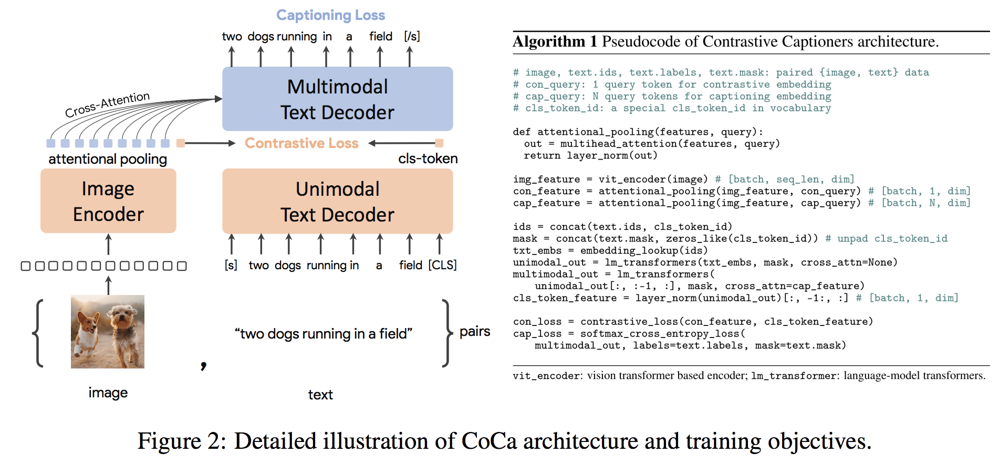

</img>

## CoCa - Pytorch

Implementation of <a href="https://arxiv.org/abs/2205.01917">CoCa, Contrastive Captioners are Image-Text Foundation Models</a>, in Pytorch. They were able to elegantly fit in contrastive learning to a conventional encoder / decoder  (image to text) transformer, achieving SOTA 91.0% top-1 accuracy on ImageNet with a finetuned encoder.

This repository also chooses to adopt the specific transformer architecture from <a href="https://arxiv.org/abs/2204.02311">PaLM</a>, for both the unimodal and multimodal transformers as well as the cross attention blocks (parallel SwiGLU feedforwards)

## Install

```bash
$ pip install coca-pytorch
```

## Usage

First install the `vit-pytorch` for the image encoder, which needs to be pretrained

```bash
$ pip install vit-pytorch>=0.40.2
```

Then

```python
import torch

# import vision transformer

from vit_pytorch.simple_vit_with_patch_dropout import SimpleViT
from vit_pytorch.extractor import Extractor

vit = SimpleViT(
    image_size = 256,
    patch_size = 32,
    num_classes = 1000,
    dim = 1024,
    depth = 6,
    heads = 16,
    mlp_dim = 2048,
    patch_dropout = 0.5  # https://arxiv.org/abs/2212.00794
)

vit = Extractor(vit, return_embeddings_only = True, detach = False)

# extractor will enable it so the vision transformer returns its embeddings

# import CoCa and instantiate it

from coca_pytorch.coca_pytorch import CoCa

coca = CoCa(
    dim = 512,                     # model dimension
    img_encoder = vit,             # vision transformer - image encoder, returning image embeddings as (batch, seq, dim)
    image_dim = 1024,              # image embedding dimension, if not the same as model dimensions
    num_tokens = 20000,            # number of text tokens
    unimodal_depth = 6,            # depth of the unimodal transformer
    multimodal_depth = 6,          # depth of the multimodal transformer
    dim_head = 64,                 # dimension per attention head
    heads = 8,                     # number of attention heads
    caption_loss_weight = 1.,      # weight on the autoregressive caption loss
    contrastive_loss_weight = 1.,  # weight on the contrastive loss between image and text CLS embeddings
).cuda()

# mock text and images

text = torch.randint(0, 20000, (4, 512)).cuda()
images = torch.randn(4, 3, 256, 256).cuda()

# train by giving CoCa your text and images with `return_loss = True`

loss = coca(
    text = text,
    images = images,
    return_loss = True  # set this to True to get the full caption + contrastive loss
)

loss.backward()

# do the above for as much text and images...
# then you can get the caption logits as so

logits = coca(
    text = text,
    images = images
) # (4, 512, 20000)

# and the CLIP-like text and image embeddings as

text_embeds, image_embeds = coca(
    text = text,
    images = images,
    return_embeddings = True
) # (4, 512), (4, 512)
```

## Citations

```bibtex
@inproceedings{Yu2022CoCaCC,
  title   = {CoCa: Contrastive Captioners are Image-Text Foundation Models},
  author  = {Jiahui Yu and Zirui Wang and Vijay Vasudevan and Legg Yeung and Mojtaba Seyedhosseini and Yonghui Wu},
  year    = {2022}
}
```

```bibtex
@inproceedings{Chowdhery2022PaLMSL,
    title   = {PaLM: Scaling Language Modeling with Pathways},
    author  = {Aakanksha Chowdhery and Sharan Narang and Jacob Devlin and Maarten Bosma and Gaurav Mishra and Adam Roberts and Paul Barham and Hyung Won Chung and Charles Sutton and Sebastian Gehrmann and Parker Schuh and Kensen Shi and Sasha Tsvyashchenko and Joshua Maynez and Abhishek Rao and Parker Barnes and Yi Tay and Noam M. Shazeer and Vinodkumar Prabhakaran and Emily Reif and Nan Du and Benton C. Hutchinson and Reiner Pope and James Bradbury and Jacob Austin and Michael Isard and Guy Gur-Ari and Pengcheng Yin and Toju Duke and Anselm Levskaya and Sanjay Ghemawat and Sunipa Dev and Henryk Michalewski and Xavier Garc{\'i}a and Vedant Misra and Kevin Robinson and Liam Fedus and Denny Zhou and Daphne Ippolito and David Luan and Hyeontaek Lim and Barret Zoph and Alexander Spiridonov and Ryan Sepassi and David Dohan and Shivani Agrawal and Mark Omernick and Andrew M. Dai and Thanumalayan Sankaranarayana Pillai and Marie Pellat and Aitor Lewkowycz and Erica Oliveira Moreira and Rewon Child and Oleksandr Polozov and Katherine Lee and Zongwei Zhou and Xuezhi Wang and Brennan Saeta and Mark Diaz and Orhan Firat and Michele Catasta and Jason Wei and Kathleen S. Meier-Hellstern and Douglas Eck and Jeff Dean and Slav Petrov and Noah Fiedel},
    year    = {2022}
}
```
